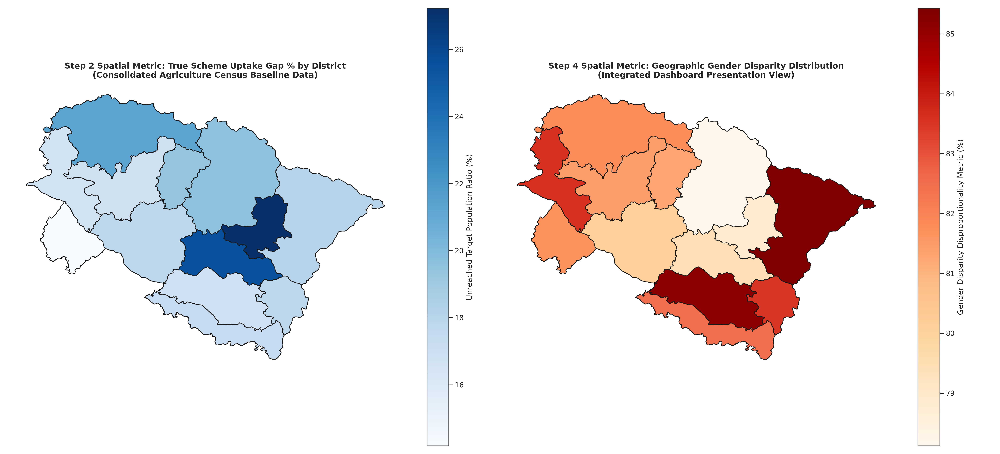
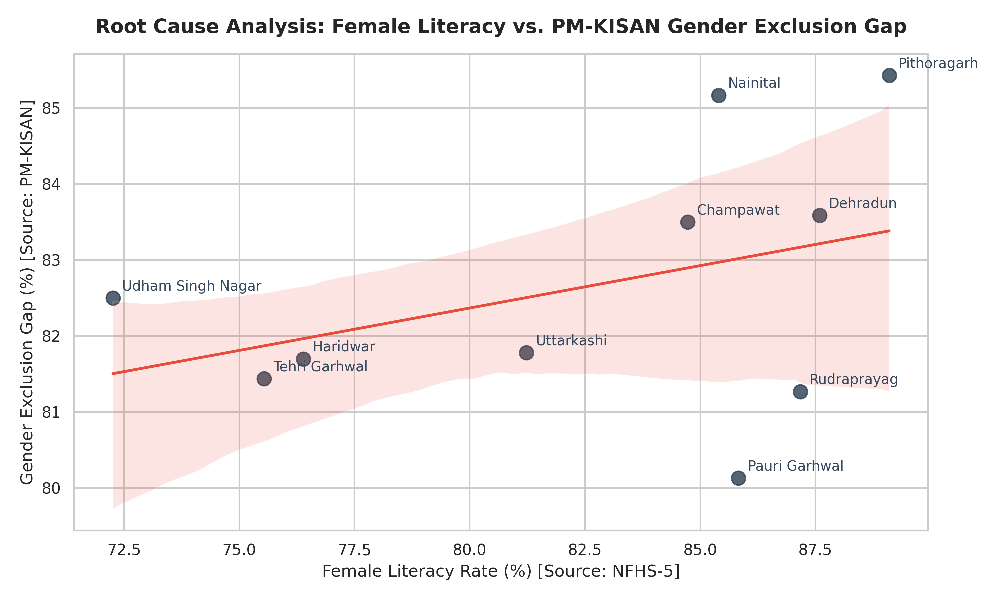

# PM-KISAN Scheme Uptake & Gender Exclusion Analytics: Uttarakhand

An end-to-end data analytics and geospatial dashboard pipeline designed to identify, evaluate, and map structural implementation gaps and regional gender disparities in the rollout of the PM-KISAN scheme across all 13 districts of Uttarakhand.

---

## 🚀 Project Overview
This project was developed as a data pipeline submission to track policy friction points in public service delivery. By combining administrative target datasets with live program registration data and socio-economic survey matrices, this pipeline uncovers critical bottlenecks in baseline policy uptake and systemic gender exclusion.

---

## 🛠️ Data Framework & Methodology

The analytical engine integrates three distinct layers of data:
1. **Target Baseline:** Consolidated operational landholding metrics extracted and mathematically aggregated from the official **Agriculture Census Document** (resolving segmented Hill vs. Plain regional records).
2. **Program Participation Snapshot:** Live beneficiary registration data from the active **PM-KISAN Database**.
3. **Socio-Economic Controls:** Regional female literacy rates sourced from the **National Family Health Survey (NFHS-5)**.

---

## 📊 Key Insights & Policy Findings

* **The Literacy-Exclusion Paradox:** Statistical correlation analysis reveals a counter-intuitive positive trend. High female literacy regions (e.g., Pithoragarh at 89.10%) paradoxically exhibit severe Gender Exclusion Gaps (85.43%). This proves that literacy alone does not mitigate exclusion when institutional land-titling predominantly favors male patriarchs.
* **Topographical Friction:** Rugged mountain terrains (e.g., Bageshwar at 27.23% uptake gap) face significantly higher service deficits than optimized plain corridors (e.g., Haridwar at 14.18%), pointing to a critical need for localized digital outreach and mobile common service centers (CSCs).

---

## 🖼️ Visualizations & Dashboards

### 1. Spatial Choropleth Dashboard
A dual-panel geographic layout mapping the true policy uptake gaps alongside the distribution of gender disparity across all 13 district polygons with zero data drops.

### 2. Root Cause Regression Graph
A statistical scatter plot with a fitted regression line highlighting the intersection of female literacy and administrative exclusion scales.

---
